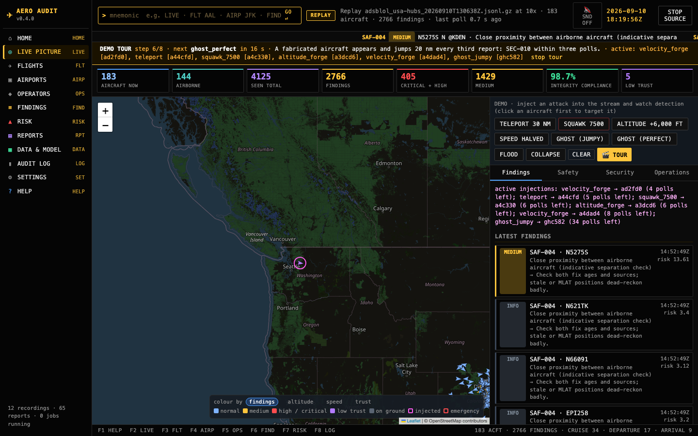
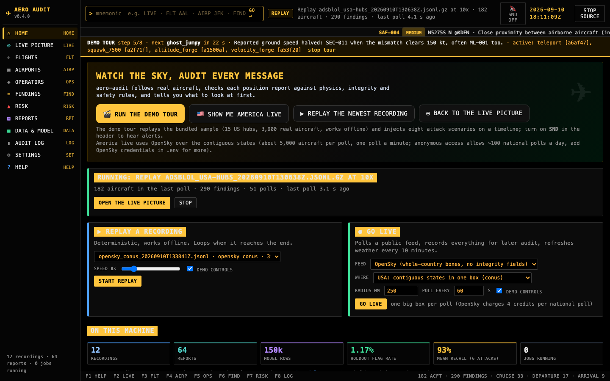
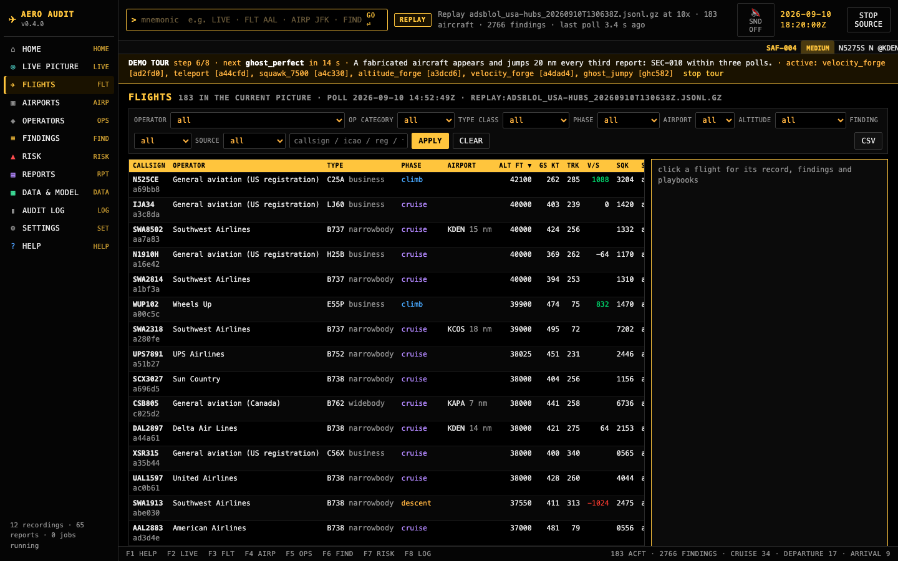
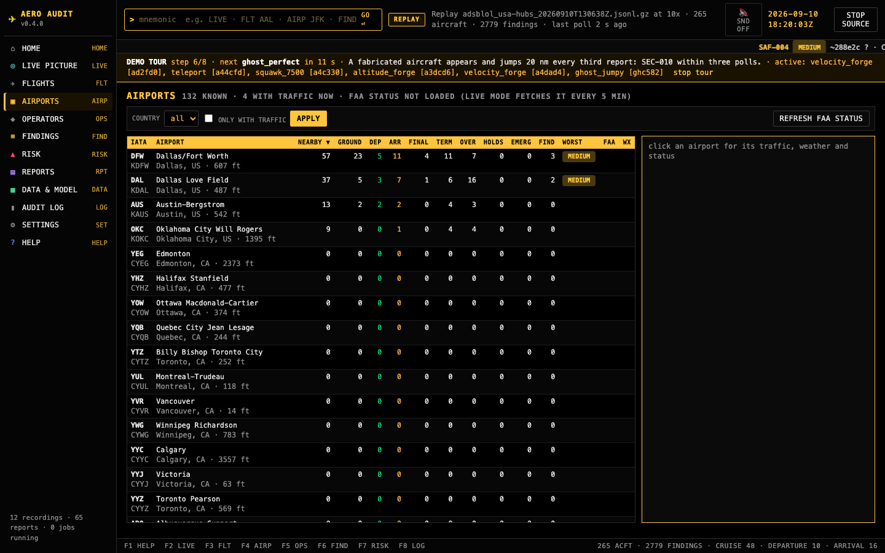
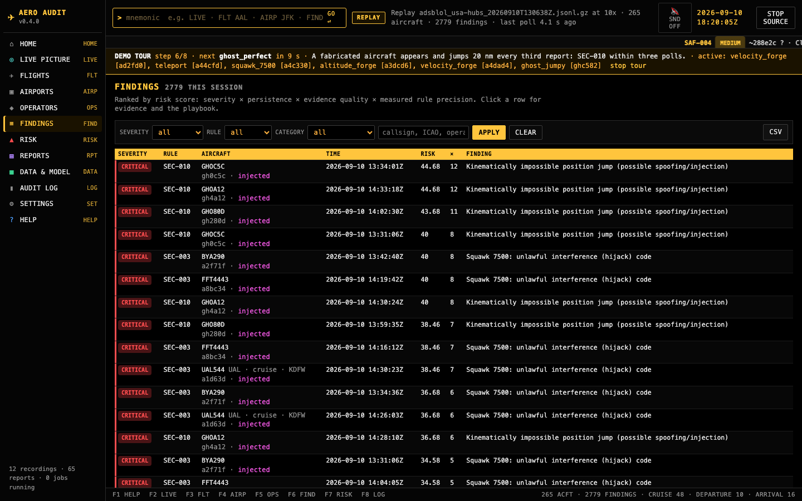

# aero-audit

[](https://github.com/monykiss/aero-audit/actions/workflows/ci.yml)
[](https://github.com/monykiss/aero-audit/actions/workflows/codeql.yml)
[](LICENSE)
[](pyproject.toml)
[](CHANGELOG.md)

**Aviation surveillance auditing, end to end.** aero-audit follows real aircraft from public
ADS-B feeds, checks every position report against physics, integrity and safety rules plus an
anomaly model, measures its own detection accuracy with injected attacks, scores risk from the
evidence, and shows all of it in a terminal-style local app whose every action and report is
tamper-evident.

It runs offline in one command, on any machine, and never transmits anything.



## Sixty seconds

```bash
git clone https://github.com/monykiss/aero-audit.git && cd aero-audit
scripts/bootstrap.sh          # macOS / Linux: .venv, hash-verified install, health check, opens the demo
```

Windows: `powershell -ExecutionPolicy Bypass -File scripts\bootstrap.ps1`. Container:
`docker run --rm -p 127.0.0.1:8787:8787 $(docker build -q .)`. Already set up: `make demo`.

The demo replays a bundled sample of real traffic (15 US hubs, 3,900 aircraft, adsb.lol, ODbL)
at 10x with a **scripted tour** that injects eight attack scenarios on a timeline. The banner
narrates each one and says what should fire. Press **F2** for the map, **F6** for findings,
**F8** for the hash-chained audit log, click **SND** to hear alerts. Full walkthrough:
[docs/DEMO.md](docs/DEMO.md).

| | |
|---|---|
|  |  |
|  |  |

## What it does

- **Ingests** adsb.lol (integrity fields NIC/NACp/SIL) and OpenSky (whole-country boxes), NOAA
  METARs and the FAA NAS status feed, all keyless; records everything as replayable JSONL.
- **Audits** every fix with explainable rules: impossible jumps, speed and altitude physics,
  integrity below 14 CFR 91.227 minimums, replayed fixes, ghosts, emergency and hijack codes with
  confirmation tiers, holding, level busts, coverage gaps, stream floods and collapses, cross-feed
  disagreement, watchlists. Every finding maps to a control reference and a response playbook.
- **Learns** the airspace's normal envelope with per-regime IsolationForests over twelve kinematic
  features, percentile-calibrated, with two-fix persistence before a finding is raised.
- **Measures itself**: `aero evaluate` perturbs real aircraft with eight attack scenarios and
  reports recall, time-to-detect and per-rule precision. Those numbers weight the risk score and
  the risk register; two scenarios are known gaps and are reported as such.
- **Understands the ecosystem**: 132 North American airports, ~80 operators, ~180 aircraft types,
  flight phases from altitude above field, FAA ground stops and delay programmes joined to traffic.
- **Sees**: tiled YOLOv8 detection on apron imagery with zone occupancy findings (optional extra).
- **Reports**: JSON, Markdown, self-contained HTML, each with provenance and a manifest of
  SHA-256 hashes; risk register with Wilson-bound likelihoods and residual risk; holding impact
  in fuel, CO2 and delay cost.
- **Shows it** in a local app: Bloomberg-style black-and-amber terminal, command line with
  mnemonics, function keys, ticker, canvas map for thousands of aircraft, dropdown filters,
  sortable grids, CSV everywhere, background jobs, live threshold tuning, in-app docs.

## Trustworthy by construction

Two things a reviewer can check rather than take on faith.

**Auditable.** The app's audit log is a hash chain: every entry carries the SHA-256 of the one
before it and of itself, so an edited, deleted or reordered line is named by `aero log verify`
and by the **CHAIN VERIFIED** badge on the Audit log page. Every report ships with a provenance
block (tool version, git commit, input recording and its hash, model hash and registry status,
evaluation hash, threshold overrides) and a manifest that `aero log verify-report` and the
**verify** link on the Reports page re-hash. Injected demo traffic is flagged in every finding.

**Secure by default.** A server on 127.0.0.1 is reachable from every web page you have open, so
the app validates the `Host` header against DNS rebinding, requires a per-process token on every
POST (which forces the CORS preflight the server never grants), checks `Origin` and
`Sec-Fetch-Site`, serves a strict Content-Security-Policy with no inline script, confines every
path parameter to the project's data directories, accepts only `http(s)` webhooks, and loads a
model only when its SHA-256 matches the registry that `aero train` wrote. Binding beyond loopback
requires a token on every API call. Dependencies install with `--require-hashes` from a universal
lock; CI runs ruff, pytest, docs-drift, `pip-audit`, gitleaks over the full history, CodeQL and a
container smoke test, with every action pinned to a commit SHA. Threat table and the reporting
policy: [SECURITY.md](SECURITY.md).

`★ Insight ─────────────────────────────────────`
- ADS-B has no cryptography, so the detection story is physics and corroboration: an injected
  fix must still agree with the aircraft's own speed, climb and history, and with a second feed.
- Detection recall is bounded by the revisit interval, not the rule: one-off manipulations are
  caught ~96% of the time at 20 s polling and ~60% at 48 s round-robin. Measured, not assumed.
- A local web app is not private by default; the same-origin policy protects the browser, not
  the server. Host validation and a custom-header token are what close that door.
`─────────────────────────────────────────────────`

## How it fits together

```
live feeds ──► normalize ──► JSONL recording ──► TrackStore (kinematics) ──► rules + ML + watchlist ──► findings
 adsb.lol       StateVector    (replayable,       implied speed, turn,        SEC/OPS/SAF, ML-001       │
 OpenSky                        .jsonl or .gz)    climb, holding             stream checks (burst,     ▼
 NOAA METAR                                                                   collapse)            risk score ──► trust ledger ──► alerts
 FAA NAS status                                                                                          │
 two feeds ──► cross-feed corroboration (dead-reckoned) ──► SEC-015                                      ▼
 imagery ──► YOLO (tiled) ──► apron zone occupancy ──► OPS-VIS findings          reports + manifests · playbooks · risk register · impact
                                                                                                          │
 local app ──► sources (replay / live) ──► LiveState (enrichment, injections, tour) ──► JSON API ──► terminal UI
               hash-chained audit log · guard (Host, CSRF, CSP, path confinement) · jobs · settings
```

```
aero_audit/
  config.py        regions, groups, settings          ecosystem.py     operator / type / phase / airport enrichment
  models.py        StateVector / Batch schema         knowledge/       airports, airlines, types (offline reference data)
  ingest/          adsblol, opensky, metar, faa_status, replay (.jsonl / .jsonl.gz), http (curl fallback)
  stream/          async poller + JSONL recorder      provenance.py    report provenance and manifests
  features/        TrackStore: per-aircraft kinematics
  audit/           rules, findings, policy (precision-weighted score), engine, reports (JSON/MD/HTML)
  ml/              IsolationForest model, trainer, registry (checksum gate), evaluation harness
  security/        threat catalog, playbooks, trust ledger, watchlist, corroboration
  risk/            5x5 register with evidence-adjusted assessment
  vision/          YOLO detection (tiled), apron zone occupancy
  web/             app (API v1), router, sources, state, jobs, security (guard), audit (hash chain), tour, static UI
  alerts.py · impact.py · tuning.py · synthetic.py · docs_build.py · cli.py
```

Architecture, data-flow guarantees and extension points: [docs/ARCHITECTURE.md](docs/ARCHITECTURE.md)
and [docs/APP.md](docs/APP.md).

## Measured results

Captured in two sessions on 2026-09-09/10 from keyless public feeds, one poller per host:
210,211 state vectors from 7,790 unique aircraft (four-hub adsb.lol rounds at 250 nm, OpenSky
regional and whole-country boxes, the global military feed, a 15-hub national round-robin).

**Anomaly model.** 150,226 airborne feature rows from 6,155 aircraft, twelve features, separate
terminal and en-route pipelines, split by aircraft (29,951 holdout rows from 1,231 unseen
aircraft). Holdout flag rate 1.17% against a 1% contamination target. Card:
`models/kinematic_iforest.md`.

**Detection (`aero evaluate`, 25 real aircraft perturbed per scenario)**

| Scenario | 20 s polling (OpenSky) | 48 s round-robin (adsb.lol) | Detecting rules |
|---|---|---|---|
| teleport (30 nm position replacement) | 96%, TTD 0 s | 96%, TTD 43 s | SEC-010 |
| velocity forgery (speed halved) | 68% | 76% | SEC-011, ML-001 |
| altitude forgery (+6,000 ft) | 96% | 88% | SEC-018, ML-001 |
| replay (fix re-sent under same address) | 100% | 100% | SEC-014, SEC-010 |
| hijack squawk 7500 | 100% | 100% | SEC-003 |
| GNSS-style integrity degradation | 100% | 100% | SEC-012 |
| slow drift (0.2 nm per poll) | 12%, known gap | 12%, known gap | corroboration needed |
| perfect ghost aircraft | 0%, known gap | 0%, known gap | corroboration needed |

Per-rule precision on the primary feed: SEC-003, SEC-010, SEC-014 at 1.00; SEC-011 0.91;
SEC-018 0.74; ML-001 0.25. These weight the risk score (`severity x (1 + 0.5 log2 repeats) x
evidence quality x precision`, ML capped at medium) and the register (hits x precision per 1,000
aircraft at the Wilson 95% lower bound, sample-size guarded, residual = inherent x (1 − control
effectiveness)).

**On real civil traffic** (9,964 aircraft-observations with the final model): zero critical
findings and exactly one high, a squawk 7500 that lasted one poll between identical normal
codes, reported as unconfirmed. **Cross-feed corroboration** (NYC, 4 rounds): 1,626 matches,
median dead-reckoned separation 0.02 nm, 95th percentile 0.10 nm, one disagreement.
**Holding impact** (defaults): 30 airline holds, 267 minutes, ~10.7 t fuel, 33.7 t CO2, 26,700 EUR.

### What the evidence changed

| Observation on real data | Change |
|---|---|
| TIS-B tracks carry NIC/NACp/SIL = 0 by design | SEC-012 scoped to ADS-B sources |
| 154 of 190 "holds" were training circuits below 3,000 ft | OPS-002 gets altitude/speed floors; pattern work is OPS-003 |
| Every speed mismatch at the default tolerance was an MLAT military track | SEC-011 tolerance x2.5 for MLAT, x2 for TIS-B |
| MLAT solutions jump 96 nm over Wyoming | SEC-010 on non-ADS-B sources is data quality, medium |
| Departures from Salt Lake City (4,227 ft) looked like altitude forgeries because ground fixes were stored as 0 ft | Mappers never fabricate 0 ft; no implied vertical rate across ground transitions |
| A live 7500 lasted one poll between identical normal codes | Emergency codes unconfirmed on one fix, escalate on the second, bypassing the cooldown |
| 2% per-fix contamination flagged ~20% of aircraft | 1% plus two-fix persistence within 10 min |
| Feed timestamps lag the batch, so the harness missed the first perturbed fix | Detections attributed by batch index; teleport recall 64% → 96% |
| A targeted demo injection expired before its round-robin region came back | Injections last N reports *of the target* |
| adsb.lol returns 429 from several clients at once | One client, round-robin regions, 429-aware back-off |
| A per-app firewall blocked Python sockets while curl worked | Providers fall back to a curl transport; `aero doctor` explains it |

## Running it

```bash
scripts/bootstrap.sh --no-demo       # or: make setup   (uv if present, else python3 -m venv; --require-hashes)
.venv/bin/aero doctor                # Python, deps, samples, model integrity, ports, feeds, audit chain
.venv/bin/aero demo                  # offline demo with the scripted tour
.venv/bin/aero app                   # empty app; pick a source on Home (replay, a hub, a country, a continent)
.venv/bin/aero serve --live --region nyc --radius 150          # real traffic, recorded as it goes
.venv/bin/aero app --host 0.0.0.0 --token "$(openssl rand -hex 24)"   # beyond loopback: token on every API call
docker compose up --build            # container, port published on 127.0.0.1 only
```

The command line: `LIVE`, `FLT DAL`, `AIRP JFK`, `FIND SEC-010`, `OPS cargo`, `LOG inject`,
`RISK`, `RPT`, `USA` (nationwide live), `TOUR`, `SND`, `STOP`. F1 to F8 jump between pages.

### The rest of the CLI

```bash
aero stream --region usa-hubs --interval 10 --seconds 1500    # capture 15 hubs in turn
aero audit --recording data/recordings/<file>.jsonl --model models/kinematic_iforest.joblib
aero train data/recordings/*.jsonl                             # fit + model card + registry entry
aero evaluate <recording> --model models/kinematic_iforest.joblib --targets 25
aero corroborate --region nyc --radius 150 --seconds 100       # two feeds, SEC-015 on disagreement
aero security threats | playbook SEC-010 | rules | watchlist-example
aero risk register | risk assess data/recordings/*.jsonl
aero impact data/recordings/*.jsonl
aero log verify | log show | log verify-report reports/<name>.manifest.json
aero config init && aero config show rules                     # aero.toml threshold overrides
aero data inventory | data prune --days 30
aero vision detect data/samples/apron_hohn.jpg --tile 320 --conf 0.10     # needs the [vision] extra
aero docs-build                                                # regenerate docs/generated from code
scripts/run_pipeline.sh                                        # train → evaluate → audit → assess → impact → docs
```

## Documentation

| Document | What it covers |
|---|---|
| [docs/DEMO.md](docs/DEMO.md) | The sixty-second demo, the tour timeline, what each panel means |
| [docs/APP.md](docs/APP.md) | Pages, terminal chrome, security, auditability, API, how to extend |
| [docs/ARCHITECTURE.md](docs/ARCHITECTURE.md) | Modules, data-flow guarantees, extension points |
| [docs/DATA_SOURCES.md](docs/DATA_SOURCES.md) | Feeds, fields, rate limits, ADS-B integrity semantics, recording format |
| [docs/RULES.md](docs/RULES.md) | Every rule: trigger, thresholds, false-positive modes, controls, tuning |
| [docs/THREAT_MODEL.md](docs/THREAT_MODEL.md) | Adversaries, why detection works without crypto, gaps and mitigations |
| [docs/COMPLIANCE_MAPPING.md](docs/COMPLIANCE_MAPPING.md) | ICAO / FAA / EASA / DO-260B, NIST CSF 2.0, SP 800-53, ISO 27001, AI RMF |
| [docs/OPERATIONS.md](docs/OPERATIONS.md) | Capture, audit, alert, corroborate, triage loop, retraining, retention |
| [docs/IMPACT.md](docs/IMPACT.md) | Stakeholders, quantified holding impact, security impact, limits |
| [docs/ML.md](docs/ML.md) | Anomaly model, vision baseline, training-data strategy |
| [docs/ROADMAP.md](docs/ROADMAP.md) | Data, detection, response, vision, assurance backlog |
| [docs/generated/](docs/generated/) | Threat matrix with measured recall, playbooks, risk register, rule ids, rendered from code |
| [SECURITY.md](SECURITY.md) · [CONTRIBUTING.md](CONTRIBUTING.md) · [CHANGELOG.md](CHANGELOG.md) | Policy, how to help, history |

## Data sources and ethics

| Source | What | Notes |
|---|---|---|
| adsb.lol | readsb JSON with NIC/NACp/SIL integrity, selected altitude | ODbL; HTTP 429 if polled faster than ~10 s or from several clients; one capture at a time |
| OpenSky Network | state vectors, position source | anonymous is rate-limited; OAuth2 client credentials in `.env` raise limits |
| NOAA AWC | METARs | context for operations findings |
| FAA NAS status | ground stops, delay programmes, closures | public XML, refreshed every 5 min in live mode |

ADS-B is an unencrypted public broadcast; receiving and analysing it is what these feeds exist
for. This project is **passive**: it never transmits and never interacts with aircraft or ATC
systems. Findings are audit signals, not accusations; a spoofing rule on a real feed most often
means a receiver merge glitch, an MLAT outlier, or a transponder fault. Recordings can identify
individuals' aircraft: keep them out of version control (they are ignored) and apply retention.

## Tests and quality

`make test` runs 80 offline tests: rules on synthetic anomalies, features, ingest mapping, ML
training and evaluation, risk math, the app API, the security guard (rebinding, CSRF, path
confinement, token mode), the audit hash chain, model integrity, provenance and manifests, the
tour, and gzip replay. `make lint` is ruff. CI fails when `docs/generated` drifts from the code.

## Roadmap

Fine-tune the detector on aerial datasets (DOTA, RarePlanes); sequence models over whole
tracks; runway and taxiway geometry for surface movement; receiver-level provenance to close
the ghost and drift gaps; FAA registry cross-checks; several concurrent sources in the app.
Details: [docs/ROADMAP.md](docs/ROADMAP.md).

## Licence and attribution

MIT. Bundled samples: adsb.lol, ODbL v1.0; apron image: Wikimedia Commons, CC BY-SA 4.0; see
[data/samples/ATTRIBUTION.md](data/samples/ATTRIBUTION.md). Map tiles: OpenStreetMap contributors.
